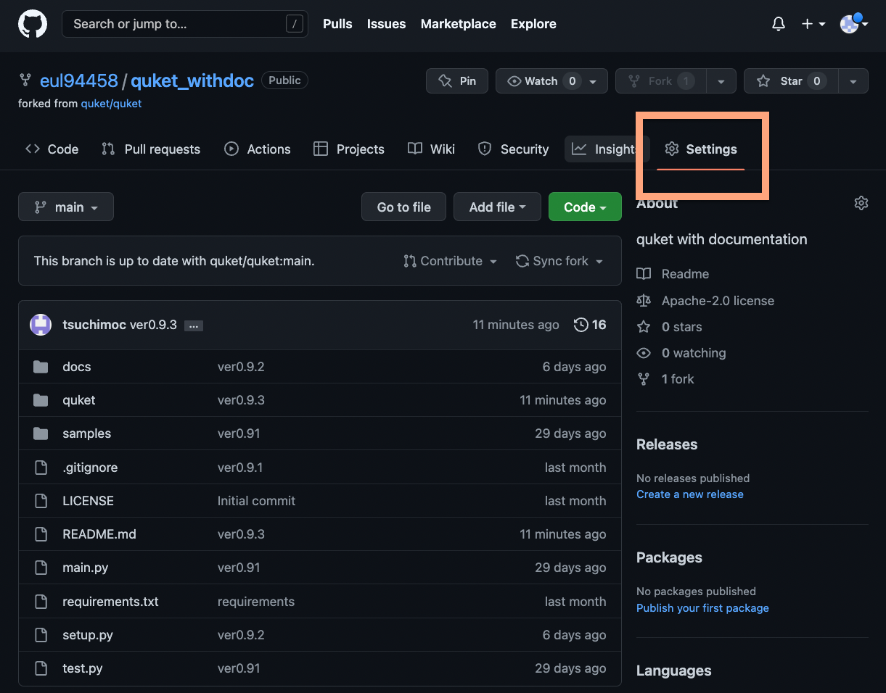
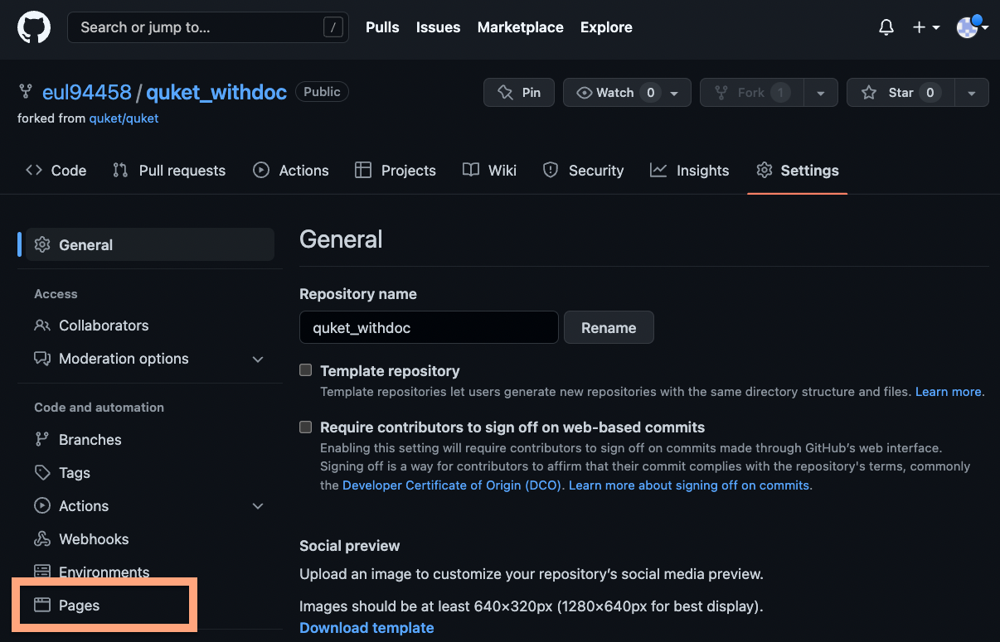
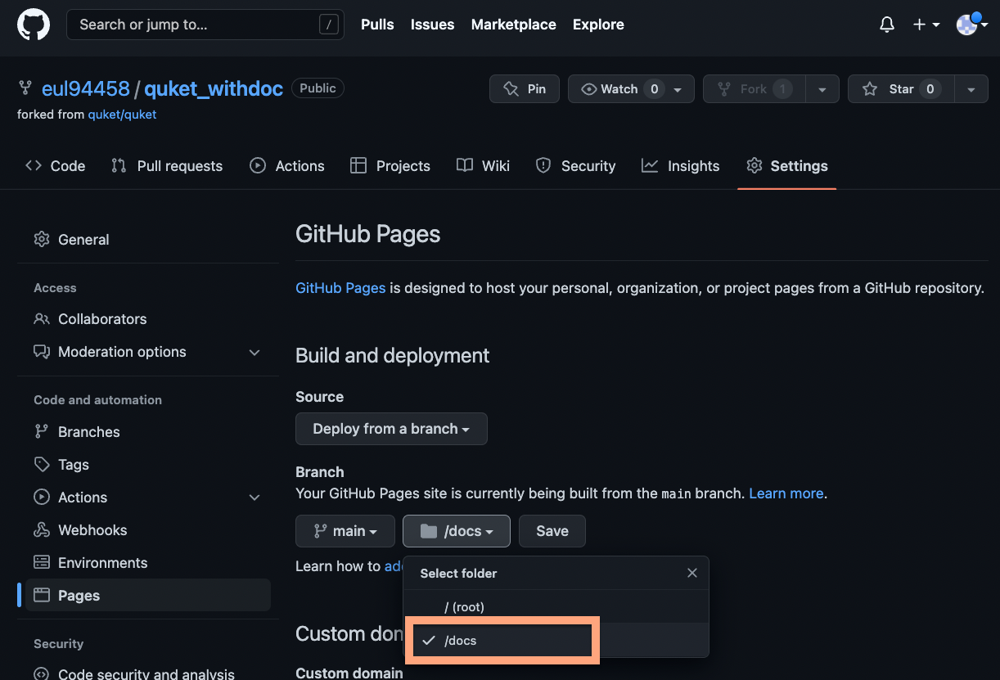
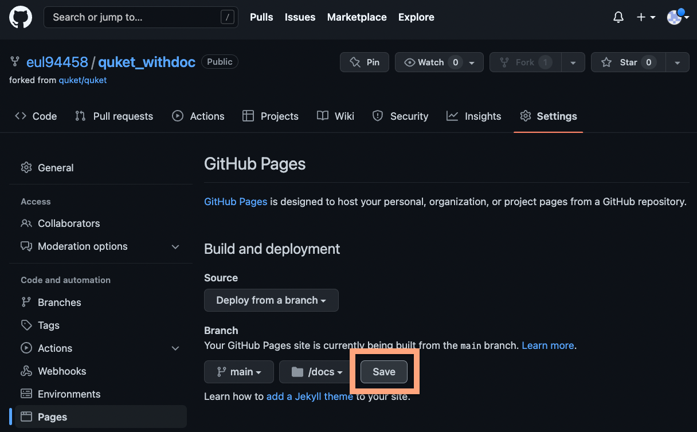

# sphinx_ghpages_walkthrough

This walk you through the process to hold Python pacakge's documentation onto the GitHub Pages.

# Install Sphinx

This walkthrough focus on Sphinx generated documentation.

Here is the list of what you need:

| Package Name       | What is it for                                                               |
|--------------------|------------------------------------------------------------------------------|
| sphinx             | Core of the documentation building software.                                 |
| sphinx-autobuild   | Build the html document site locally, with real-time monitor to changes.     |
| sphinx-autoapi     | Auto-generatation of the documentation. Parse codes and create htmls.        |
| myst_parser        | Sphinx do not support Markdown natively. So you need this.                   |
| sphinx_rtd_theme   | HTML theme.                                                                  |
| sphinx-book-theme  | Another HTML theme. Looks better than above.                                 |
| sphinx-copybutton  | Make a button for reader to copy a piece of code shown in the documentation. |


> in terminal

```commandline
pip install --upgrade pip
pip install --no-cache-dir sphinx sphinx-autobuild sphinx-autoapi myst_parser sphinx_rtd_theme sphinx-book-theme sphinx-copybutton
```

# Folder Structure

| Folder Name      | What is it for                              |
|------------------|---------------------------------------------|
| docs             | HTML files if being put here.               |
| sphinx           | Sphinx if configured here                   |
 | src              | Containing all source code of your package. |
    
    MyRepository/
    ├─ docs/
    ├─ sphinx/
    │  ├─ build/
    │  ├─ source/
    ├─ src/
    │  ├─ source_code_1.py
    │  ├─ source_code_2.py
    ├─ .gitignore
    ├─ README.md

# Initiate Sphinx

> in terminal

```commandline
cd <MyRepository's Path>
mkdir sphinx 
cd sphinx
sphinx-quickstart
```

> Welcome to the Sphinx 4.5.0 quickstart utility.
> 
> Please enter values for the following settings (just press Enter to
> accept a default value, if one is given in brackets).
> 
> Selected root path: .
> 
> You have two options for placing the build directory for Sphinx output.
> Either, you use a directory "_build" within the root path, or you separate
> "source" and "build" directories within the root path.  
> \> Separate source and build directories (y/n) [n]: 

```commandline
y
```

Nothing matters after this line. Since everything can be changed afterwards.

Now you should have stuffs being added to the sphinx folder.

    MyRepository/
    ├─ sphinx/
       ├─ build/
       ├─ source/
       │  ├─ _static/
       │  ├─ _templates/ 
       ├─ conf.py                              
       ├─ make.bat                              
       ├─ Makefiles

Things we care are:

- conf.py
- _templates/

# Setting Up

1. Replace the whole conf.py with the one that I made.
2. Get the templates that I made. Because the default template is useless.

You can find these files in this repository with the same file structure.

| Where should it belongs to                     | File Link                                                         |
|------------------------------------------------|-------------------------------------------------------------------|
 | source/conf.py                                 | [conf.py](./source/conf.py)                                       |
| ***                                            |                                                                   |
| source/_templates/apidoc/module.rst_t          | [module.rst_t](./source/_templates/apidoc/module.rst_t)           |
| source/_templates/apidoc/package.rst_t         | [package.rst_t](./source/_templates/apidoc/package.rst_t)         |
| source/_templates/apidoc/toc.rst_t             | [toc.rst_t](./source/_templates/apidoc/toc.rst_t)                 |
| ***                                            |                                                                   |
| source/_templates/autoapi/python/attribute.rst | [attribute.rst](./source/_templates/autoapi/python/attribute.rst) |
| source/_templates/autoapi/python/class.rst     | [class.rst](./source/_templates/autoapi/python/class.rst)         |
| source/_templates/autoapi/python/data.rst      | [data.rst](./source/_templates/autoapi/python/data.rst)           |
| source/_templates/autoapi/python/exception.rst | [exception.rst](./source/_templates/autoapi/python/exception.rst) |
| source/_templates/autoapi/python/function.rst  | [function.rst](./source/_templates/autoapi/python/function.rst)   |
| source/_templates/autoapi/python/method.rst    | [method.rst](./source/_templates/autoapi/python/method.rst)       |
| source/_templates/autoapi/python/module.rst    | [module.rst](./source/_templates/autoapi/python/module.rst)       |
| source/_templates/autoapi/python/package.rst   | [package.rst](./source/_templates/autoapi/python/package.rst)     |

- Question: 
  - You said we only use sphinx-autoapi, why we need templates for sphinx-apidoc?

  > There is a bug that during the process of auto-generation, some functions and modules are being routed to the sphinx-apidoc routine. Those template is to route them back to sphinx-autoapi.

- Question: 
  - Why not sphinx-apidoc?

  > sphinx-apidoc by the offical is a failure and unuseable. That's what sphinx-autoapi exist. 

# Build and Preview the website

> in terminal

```commandline
cd <MyRepository's Path>/sphinx
sphinx-autobuild ./source ../docs
```

Explained:
    
    sphinx-autobuild [path that needed to monitor its changes] [path that the HTML output files go]

If there is no any fatal issue during the auto-generation process, you should be able to watch the thing in `http://127.0.0.1:8000`.

```commandline
http://127.0.0.1:8000
```

- Question: 
  - The building process is not stopping. It is doing the same thing over and over.
  
  > 1. `Ctrl+C` to stop that.
  > 2. Run `sphinx-autobuild ./source ../docs` again.
  > 3. If this does not fix the problem, than it is a fatal issue that sphinx cannot parse your package's docstrings. You should review your docstrings.

- Question: 
  - New changes is not reflected on the http://127.0.0.1:8000.
  
  > You need to rebuild the HTML.
  > First delete `docs/` then delete `sphinx/source/autoapi/`,   
  > so that sphinx-autobuild detects that and rebuild everything.

# Git commit and Git push

`<MyRepository's Path>/docs` is the static HTML webpage of the auto-generated documentation. If you are happy after previewing the result, you may commit and push it to remote branch.

> in terminal

```commandline
git add ../docs
git commit -m "added documentation"
git push
```

# Publish the target repository (Optional)

Free usage of GitHub Pages required a public repository.

But:

1. If you are not going to publish it right now, you can do this later. 
2. If you want to see the effect of the documentation webpage, you can do it locally using sphinx-autobuild.

# Setup the GitHub Pages (Optional)




